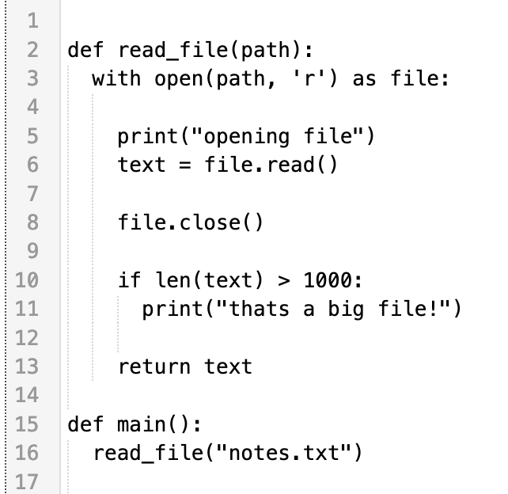

# CodeMirror Indentation Markers

<span><a href="https://replit.com/@util/codemirror-indentation-markers" title="Run on Replit badge"></a></span>
<span><a href="https://www.npmjs.com/package/@replit/codemirror-indentation-markers" title="NPM version badge"></a></span>

A CodeMirror extension that renders indentation markers using a
heuristic similar to what other popular editors, like Ace and Monaco, use.



### Usage

```ts
import { basicSetup } from 'codemirror';
import { EditorState } from '@codemirror/state';
import { EditorView } from '@codemirror/view';
import { indentationMarkers } from '@replit/codemirror-indentation-markers';

const doc = `
def max(a, b):
  if a > b:
    return a
  else:
    return b
`

new EditorView({
  state: EditorState.create({
    doc,
    extensions: [basicSetup, indentationMarkers()],
  }),
  parent: document.querySelector('#editor'),
});

```

### Options

You can provide an options object to `indentationMarkers()` with the following
optional properties:

- `highlightActiveBlock`
    
    Boolean that determines whether the active block marker is styled
    differently. Setting this to `false` provides a significant performance
    enhancement because it means that markers do not need to be regenerated
    when the selection changes. Defaults to `true`.
 
- `hideFirstIndent`

    Boolean that determines whether markers in the first column are omitted.
    Defaults to `false`.
  
- `markerType`
  
    String that determines how far the indentation markers extend. `"fullScope"` indicates that the markers extend down the full height of a scope. With the `"codeOnly"` option, indentation markers terminate at the last nonempty line in a scope. Defaults to `"fullScope"`.

- `thickness`

    Integer that determines the thickness in pixels of the indentation markers. Defaults to `1`.

- `activeThickness`

    Integer that determines the thickness in pixels of the active indentation markers. If `undefined` or `null` then `thickness` will be used. Defaults to `undefined`.

- `colors`

    Object that determines the colors of the indentation markers.

    - `light`

        String that determines the color of the markers when the editor has a light theme. Defaults to `#F0F1F2`.

    - `dark`

        String that determines the color of the markers when the editor has a dark theme. Defaults to `#2B3245`.

    - `activeLight`

        String that determines the color of the active block marker when the editor has a light theme. Only applies if `highlightActiveBlock` is `true`. Defaults to `#E4E5E6`.

    - `activeDark`

        String that determines the color of the active block marker when the editor has a dark theme. Only applies if `highlightActiveBlock` is `true`. Defaults to `#3C445C`.

#### Example

```ts
new EditorView({
  state: EditorState.create({
    doc,
    extensions: [
      basicSetup,
      indentationMarkers({
        highlightActiveBlock: false,
        hideFirstIndent: true,
        markerType: "codeOnly",
        thickness: 2,
        colors: {
          light: 'LightBlue',
          dark: 'DarkBlue',
          activeLight: 'LightGreen',
          activeDark: 'DarkGreen',
        }
      })
    ],
  }),
  parent: document.querySelector('#editor'),
});
```
